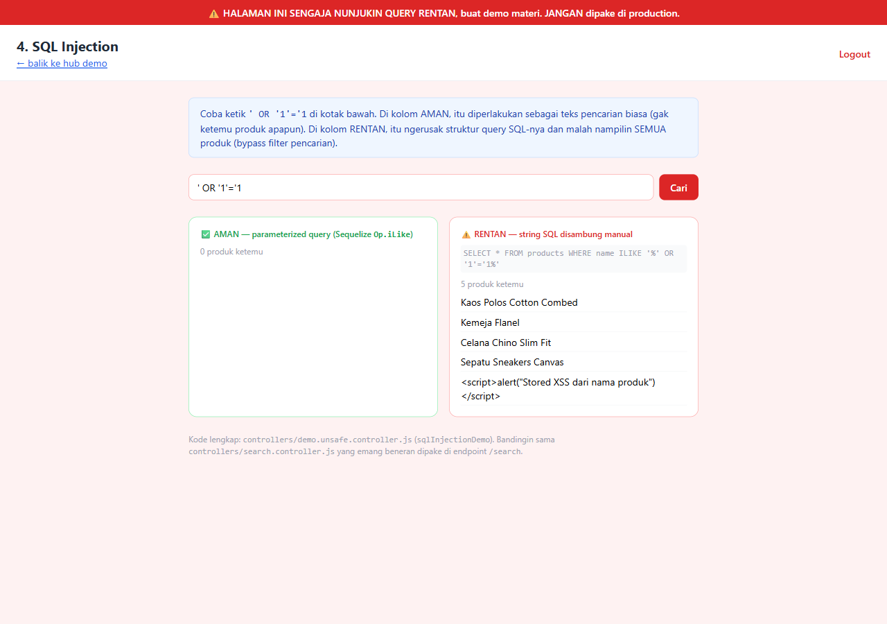
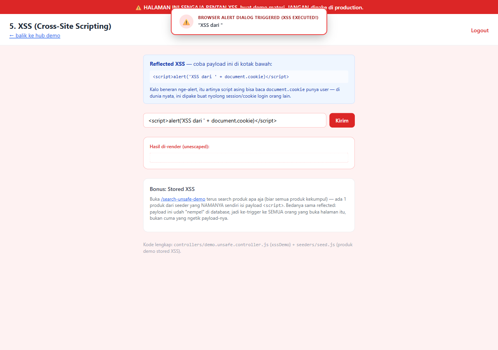
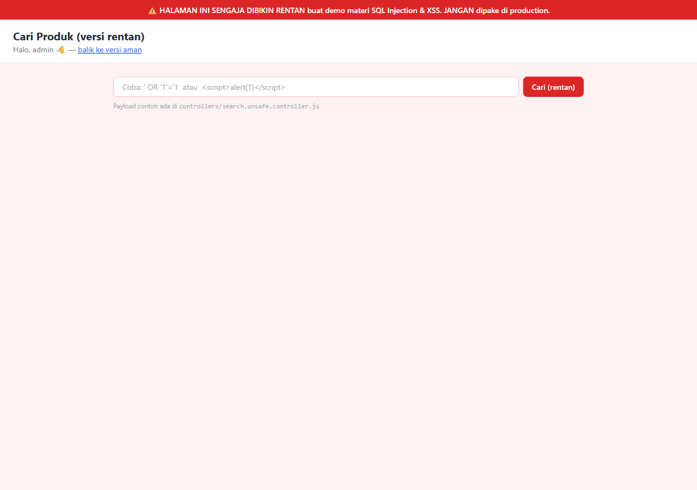
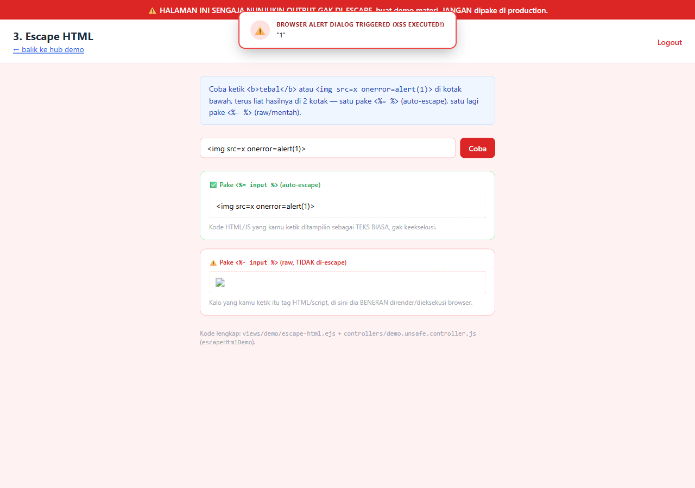
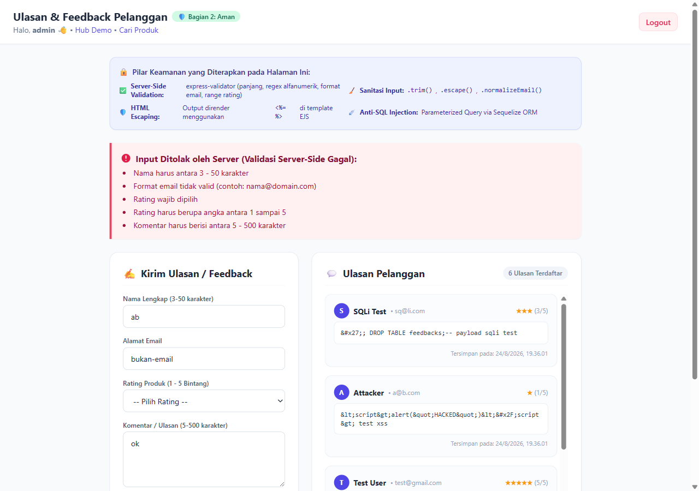
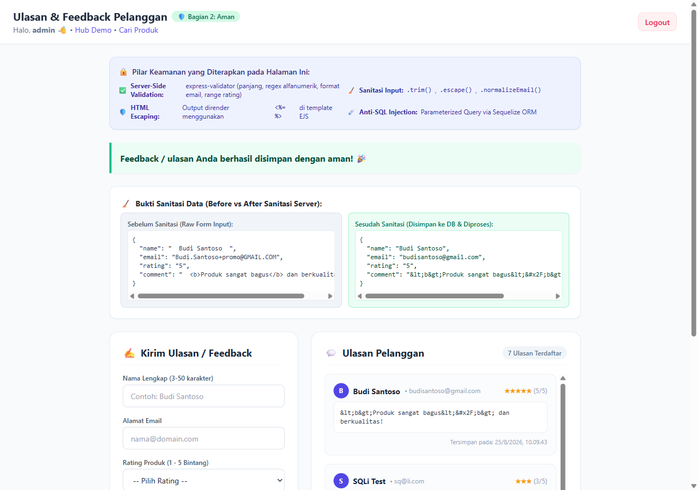
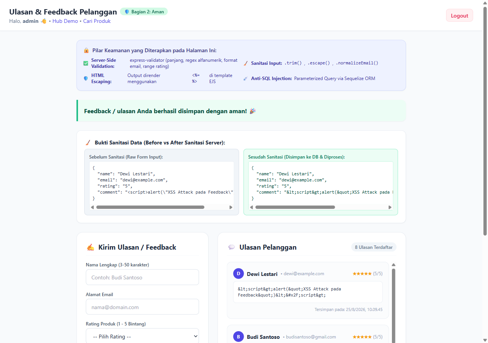
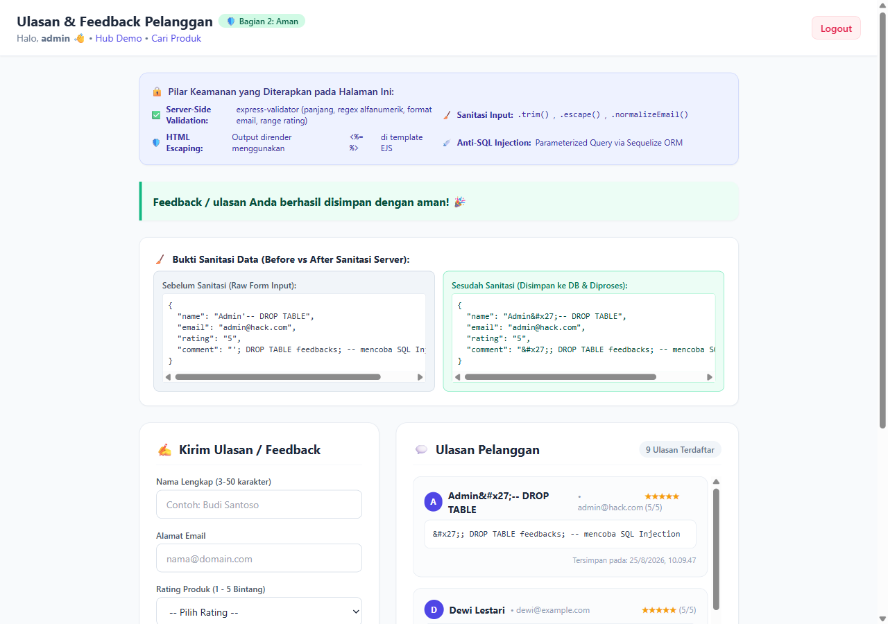

# TUGAS 12 – WEB SECURITY (VALIDASI, SANITASI, ESCAPE HTML, SQL INJECTION, XSS)

**Nama**: Ayuningtyas Dyah Septiani
**NIM**: 20240140255
**Kelas**: B

---

## Bagian 1 — Eksplorasi Kerentanan

### 1. SQL Injection
**Payload:** `' OR '1'='1`



Payload tembus karena di file `controllers/demo.unsafe.controller.js` (baris 28) query SQL digabung manual pakai template literal, sehingga kondisi `'1'='1'` yang selalu TRUE membuat semua produk muncul di kolom rentan.

### 2. XSS Reflected
**Payload:** `<script>alert('XSS dari ' + document.cookie)</script>`



Payload tembus karena di file `views/demo/xss.ejs` (baris 40) input user dicetak mentah pakai tag `<%- %>` tanpa di-escape, sehingga browser langsung mengeksekusi tag `<script>` tersebut.

### 3. XSS Stored
**Payload:** `<script>alert("Stored XSS dari nama produk")</script>`



Payload tembus karena nama produk yang sudah mengandung script jahat (dari `seeders/seed.js`) dicetak mentah pakai `<%- %>` di `views/search-unsafe.ejs` (baris 62), sehingga alert muncul otomatis saat halaman dibuka siapa saja.

### 4. Escape HTML
**Payload:** ``



Di kotak aman (`<%= %>`), tag HTML diubah jadi entitas teks biasa. Di kotak rentan (`<%- %>`), tag `` dirender mentah sehingga event `onerror=alert(1)` dieksekusi browser.

---

## Bagian 2 — Implementasi Mandiri (Form Feedback `/feedback`)

### 1. Validasi Server-Side



Submit data invalid (nama 2 huruf, email salah format, rating kosong, komentar 2 huruf) ditolak server dengan pesan error spesifik per field. Validasi menggunakan `express-validator` di `middlewares/validators.js`.

### 2. Sanitasi Input (Kode + Before/After)
**Kode sanitasi** di `middlewares/validators.js`:
```js
body('name').trim().escape(),
body('email').trim().normalizeEmail(),
body('comment').trim().escape()
```

**Contoh before/after:**
| Field | Before (raw input) | After (tersanitasi) |
|-------|---------------------|---------------------|
| name | `  Budi Santoso  ` | `Budi Santoso` |
| email | `Budi.Santoso+promo@GMAIL.COM` | `budisantoso@gmail.com` |
| comment | `  <b>Produk bagus</b>  ` | `&lt;b&gt;Produk bagus&lt;&#x2F;b&gt;` |



### 3. Escape HTML saat Render



Input `<script>alert("XSS Attack pada Feedback")</script>` tidak tereksekusi dan hanya tampil sebagai teks biasa. Ini karena di `views/feedback.ejs` semua output menggunakan tag `<%= %>` yang otomatis meng-escape karakter HTML.

### 4. Parameterized Query / ORM
**Kode query** di `controllers/feedback.controller.js`:
```js
// INSERT
const newFeedback = await Feedback.create({
  name: sanitizedData.name,
  email: sanitizedData.email,
  rating: parseInt(sanitizedData.rating, 10),
  comment: sanitizedData.comment,
});

// SELECT
const feedbacks = await Feedback.findAll({
  order: [['createdAt', 'DESC']],
});
```

Sequelize ORM otomatis menggunakan parameterized query, sehingga input user tidak pernah jadi bagian dari struktur SQL.

### 5. Serangan Gagal Tembus



Halaman `/feedback` diserang dengan payload SQL Injection (`Admin'-- DROP TABLE`) dan XSS (`<script>alert(1)</script>`). Semua serangan gagal — data tersimpan sebagai teks biasa, tabel database tetap utuh, dan tidak ada alert yang muncul.
